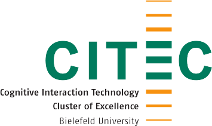

# Food Cutting Robots

This projects deals with the problem of teaching robots how to execute unknown tasks as motivated in the following picture:

<br>

To create the ontology employed by the robots for covering knowledge about food objects and the manipulation action *Cutting*, we propose a [manipulation-focused knowledge engineering methodology](Methodology/README.md).
As part of this methodology, we created a task hierarchy from WikiHow instructions to get a broad range of *cut* hyponyms that are actually used in recipe instructions, like *dice*, *halve* or *slice*. For the analysis of the WikiHow articles, we developed the [WikiHow-Analysis-Tool](https://github.com/Janfiderheld/WikiHow-Robot-Instruction-Extraction).

Additionally, we defined, formalized and extracted **task-specific object knowledge**, which includes object properties like shape, size and anatomical parts that influence the task execution. This knowledge is combined with the task hierarchies and linked to other ontologies like [SOMA](https://github.com/ease-crc/soma) and [FoodOn](https://foodon.org/) to create the [Food-Cutting-Ontology](food_cutting.owl).

For the execution on a robot, we use the <a href="https://github.com/cram2/cram">CRAM cognitive architecture</a> and the knowledge graph for robotic applications in the <a href="https://github.com/knowrob/knowrob">KnowRob knowledge processing system</a>.
A robot running KnowRob would query for all subclasses of a given class to find out what movements need to be performed to successfully execute an action such as in the following SPARQL query called with Prolog that is also available on <a href="https://krr.triply.cc/mkumpel/-/queries/All-Movements-for-Action/1">triply</a> to then query if the given food can be used for the given action. For this, the robot needs to use a reasoner.

```bash
use_module(library(semweb/rdf_db)).             #load rdf module to load the ontology
rdf_load('food_cutting.owl').                   #load ontology
use_module(library(semweb/sparql_client)).      #load SPARQL module
sparql_query(                                   #call SPARQL query

'PREFIX owl: <http://www.w3.org/2002/07/owl#>
PREFIX SOMA: <http://www.ease-crc.org/ont/SOMA.owl#>
PREFIX rdf: <http://www.w3.org/1999/02/22-rdf-syntax-ns#>
PREFIX rdfs: <http://www.w3.org/2000/01/rdf-schema#>

Select DISTINCT  ?obj2 ?obj ?act  WHERE {
      # find all subclasses of a given action (here:slicing)
  ?act rdfs:subClassOf SOMA:Slicing.
  	  # if available, find all subclasses of the subclass
  OPTIONAL{
    ?obj rdfs:subClassOf ?act.
      # if available, find all subclasses of the subclass
  OPTIONAL{
    ?obj2 rdfs:subClassOf ?obj.}}
  }', Row,
  [endpoint('https://api.krr.triply.cc/datasets/mkumpel/FruitCuttingKG/services/FruitCuttingKG/sparql')]).
```

Similarly, this can be done in Prolog using the following statement:

```bash
use_module(library(semweb/rdf_db)).             #load rdf module to load the ontology
rdf_load('food_cutting.owl').                   #load ontology
use_module(library(semweb/sparql_client)).      #load SPARQL module
rdf(?act, rdfs:subClassOf, SOMA:Slicing), optional(rdf(?task, rdfs:subClassOf, ?act)), optional(rdf(?motion, rdfs:subClassOf, ?task)).
```
## Querying the Ontology 

You can try out how a robot would query the ontology using [Protégé](https://protege.stanford.edu/) and a standard reasoner like HermiT like in the following picture:

<br>

Once you started the reasoner, you can find out what food can be sliced, for example. We provide a small number of exemplary [DL queries](ExampleQueries.md). If you add additional parameters that are available in the ontology like the initial shape of an object, you can narrow down the results to all round food that can be sliced, for example:

<br>

In the same manner, you can find out what oval food can be sliced, what food needs its core to be removed or what food needs to be peeled:

<br>

All information in the stated ontology is accessible by the robot through queries at runtime. The action designator also uses Prolog as the inference engine to convert symbolic action descriptions into ROS action goals or similar data structures. Since the inference engine is already in Prolog, necessary information can be acquired through queries. This goes beyond the newest cutting action designator and is available in the open-source framework CRAM for all designators. 

The updated action designator for cutting (which includes the actions slicing and halving) can be found [in this repo](cutting_action_designator.lisp). This is just the specific designator part where parameters can be infered. To see the full potential of the generlized action designators please visit the <a href="https://cram-system.org/">CRAM website</a>. 

For example, a robot would query for the arm to use for action execution to then infer the action parameter as in the following:

```bash
 ;; infere information which robot arm to use eitehr internally or query ontology
    (-> (spec:property ?action-designator (:arm ?arm))
        (true)
        (man-int:robot-free-hand ?_ ?arm))
        
 ;; infere information which robot trajectory to use eitehr internally or query ontology
    (-> (equal ?arm :left)
        (and (lisp-fun man-int:get-action-trajectory :slicing ?arm ?grasp T ?objects
                       ?left-slicing-pose)
             (lisp-fun man-int:get-traj-poses-by-label ?left-slicing-pose :slice-up
                       ?left-slice-up-poses)
             (lisp-fun man-int:get-traj-poses-by-label ?left-slicing-pose :slice-down
                       ?left-slice-down-poses))
        (and (equal ?left-slice-up-poses NIL)
             (equal ?left-slice-down-poses NIL)))
 ```
 
 Similarly, the robot would infer if it has to perform a slicing motion (as above) or a halving motion as in the following
 
 ```bash
 ;; infere information where to cut eitehr internally or query ontology
    (-> (spec:property ?action-designator (:object-half-pose ?object-half-pose))
        (true)
        (format "Please infer where to cut the object, or use the query system to infer it here"))
   
 ;; infere information which robot trajectory to use eitehr internally or query ontology
    (-> (equal ?arm :left)
        (and (lisp-fun man-int:get-action-trajectory :halving ?arm ?grasp T ?objects
                       ?left-halving-pose)
             (lisp-fun man-int:get-traj-poses-by-label ?left-halving-pose :halvin-up
                       ?left-slice-up-poses)
             (lisp-fun man-int:get-traj-poses-by-label ?left-halving-pose :halving-down
                       ?left-slice-down-poses))
        (and (equal ?left-slice-up-poses NIL)
             (equal ?left-slice-down-poses NIL)))
  ```
        

## Disclaimer

This knowledge graph is made available under the <a href="http://opendatacommons.org/licenses/by/1.0/">Open Data Commons Attribution License</a>. It is publicly available here and on <a href="https://api.krr.triply.cc/datasets/mkumpel/FruitCuttingKG/services/FruitCuttingKG/sparql">triply</a> for inspection and querying, many thanks to the <a href="https://krr.cs.vu.nl/">knowledge representation and reasoning group</a> at the Vrije Universiteit Amsterdam.

This knowledge graph has been created by the <a href="https://ai.uni-bremen.de/">Institute for Artificial Intelligence</a> at the University of Bremen as well as the <a href="https://www.uni-bielefeld.de/fakultaeten/technische-fakultaet/arbeitsgruppen/semantic-computing/">Semantic Computing Group</a> at the Cluster of Excellence Cognitive Interaction Technology at Bielefeld University. Please contact <a href="https://ai.uni-bremen.de/team/michaela_k%C3%BCmpel">Michaela Kümpel</a> (michaela(dot)kuempel(at)uni-bremen(dot)de) or Jan-Philipp Töberg (jtoeberg(at)techfak(dot)uni-bielefeld(dot)de) for further information or collaboration.

<p align="center" width="100%">
      
      
      
</p>
