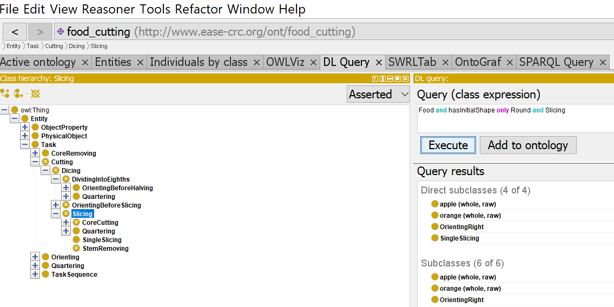
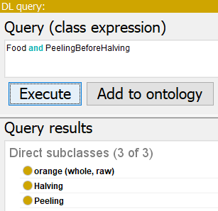

# Querying the Ontology 

You can try out how a robot would query the ontology using [Protégé](https://protege.stanford.edu/) and a standard reasoner like HermiT like in the following picture:

<br>

Once you started the reasoner, you can find out what food can be sliced, for example. We provide a small number of exemplary [DL queries](ExampleQueries.md). If you add additional parameters that are available in the ontology like the initial shape of an object, you can narrow down the results to all round food that can be sliced, for example:

<br>

In the same manner, you can find out what oval food can be sliced, what food needs its core to be removed or what food needs to be peeled:

<br>

All information in the stated ontology is accessible by the robot through queries at runtime. The action designator also uses Prolog as the inference engine to convert symbolic action descriptions into ROS action goals or similar data structures. Since the inference engine is already in Prolog, necessary information can be acquired through queries. This goes beyond the newest cutting action designator and is available in the open-source framework CRAM for all designators. 

The updated action designator for cutting (which includes the actions slicing and halving) can be found [in this repo](cutting_action_designator.lisp). This is just the specific designator part where parameters can be infered. To see the full potential of the generlized action designators please visit the <a href="https://cram-system.org/">CRAM website</a>. 

For example, a robot would query for the arm to use for action execution to then infer the action parameter as in the following:

```bash
 ;; infer information which robot arm to use either internally or query ontology
    (-> (spec:property ?action-designator (:arm ?arm))
        (true)
        (man-int:robot-free-hand ?_ ?arm))
        
 ;; infer information which robot trajectory to use either internally or query ontology
    (-> (equal ?arm :left)
        (and (lisp-fun man-int:get-action-trajectory :slicing ?arm ?grasp T ?objects
                       ?left-slicing-pose)
             (lisp-fun man-int:get-traj-poses-by-label ?left-slicing-pose :slice-up
                       ?left-slice-up-poses)
             (lisp-fun man-int:get-traj-poses-by-label ?left-slicing-pose :slice-down
                       ?left-slice-down-poses))
        (and (equal ?left-slice-up-poses NIL)
             (equal ?left-slice-down-poses NIL)))
 ```
 
 Similarly, the robot would infer if it has to perform a slicing motion (as above) or a halving motion as in the following
 
 ```bash
 ;; infer information where to cut either internally or query ontology
    (-> (spec:property ?action-designator (:object-half-pose ?object-half-pose))
        (true)
        (format "Please infer where to cut the object, or use the query system to infer it here"))
   
 ;; infer information which robot trajectory to use either internally or query ontology
    (-> (equal ?arm :left)
        (and (lisp-fun man-int:get-action-trajectory :halving ?arm ?grasp T ?objects
                       ?left-halving-pose)
             (lisp-fun man-int:get-traj-poses-by-label ?left-halving-pose :halving-up
                       ?left-slice-up-poses)
             (lisp-fun man-int:get-traj-poses-by-label ?left-halving-pose :halving-down
                       ?left-slice-down-poses))
        (and (equal ?left-slice-up-poses NIL)
             (equal ?left-slice-down-poses NIL)))
  ```

[back](./)