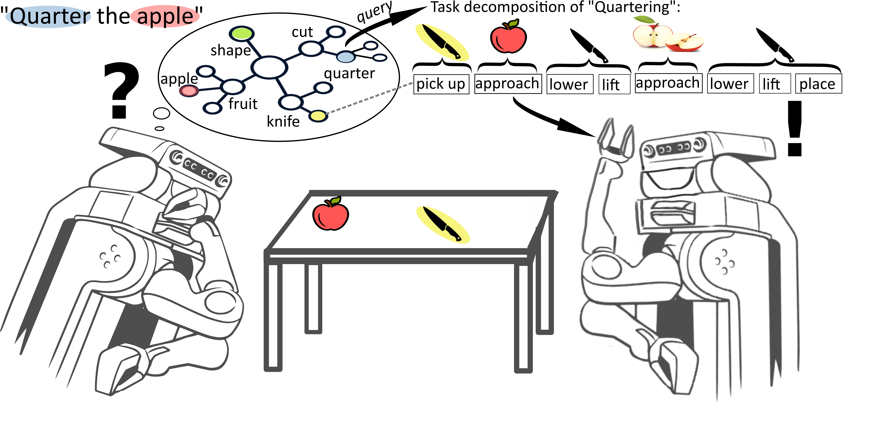

# Food Cutting Robots

This project deals with the problem of teaching robots how to execute unknown tasks in the household domain. The focus of this repository lies on the task of *Cutting Food*, especially fruits and vegetables.
This website provides an extensive documentation of the approach and its different aspects.

   

This github repository contains the created knowledge graph, the CRAM action designator and additional resources created by following [our methodology](https://food-ninja.github.io/FoodCutting/Methodology.html).
Additionally, the `food_extraction` folder contains all intermediate results used for extracting knowledge about fruits and vegetables from the [FoodOn](https://doi.org/10.1038/s41538-018-0032-6).
For the simulation of the cutting task, please refer to [this repository](https://github.com/Food-Ninja/FoodNinjaSimulation) instead.

## Disclaimer

The knowledge graph is made available under the [Open Data Commons Attribution License](http://opendatacommons.org/licenses/by/1.0/). It is publicly available [here](https://github.com/Food-Ninja/FoodCutting/blob/main/food_cutting.owl) and on [triply](https://api.krr.triply.cc/datasets/mkumpel/FruitCuttingKG/services/FruitCuttingKG/sparql) for inspection and querying, many thanks to the [knowledge representation and reasoning group](https://krr.cs.vu.nl/) at the Vrije Universiteit Amsterdam.

This work has been created by the [Institute for Artificial Intelligence](https://ai.uni-bremen.de/) at the University of Bremen as well as the [Semantic Computing Group](https://www.uni-bielefeld.de/fakultaeten/technische-fakultaet/arbeitsgruppen/semantic-computing/) at the Cluster of Excellence Cognitive Interaction Technology at Bielefeld University. Please contact [Michaela Kümpel](https://ai.uni-bremen.de/team/michaela_k%C3%BCmpel) (michaela(dot)kuempel(at)uni-bremen(dot)de) or [Jan-Philipp Töberg](https://www.uni-bielefeld.de/fakultaeten/technische-fakultaet/arbeitsgruppen/semantic-computing/team/jan-philipp-toeberg/) (jtoeberg(at)techfak(dot)uni-bielefeld(dot)de) for further information or collaboration.

      
      
      

