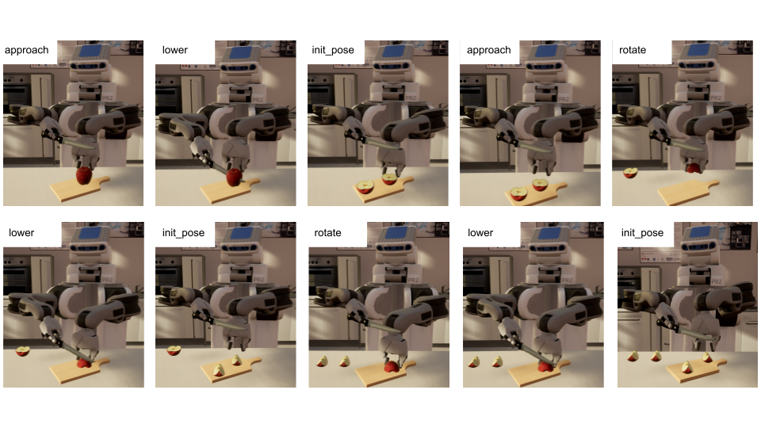

# [Simulation](https://github.com/Food-Ninja/FoodNinjaSimulation)

We want to qualitativly show that a robot using the created ontology can infer the tools and motions needed to perform an unknown task like "*Quartering an apple*”.
To simplify the experiment, we assume some existing knowledge and capabilities:

- While not knowing specific terms like “*Quartering*”, the robot already knows how to cut an object
- The robot is able to successfully perceive given objects for the experiment: a knife and an apple
- The robot is also able to grasp and hold a knife and an apple

We use a simulation environment inside the [Unreal Engine](https://www.unrealengine.com/de) together with tools like [URoboSim](https://github.com/NeumannM89/URoboSim)[^1] to gain complete control over the environment and precisely manipulate and monitor all factors that will affect the robot’s behaviour.
This includes everything from the sensory input the robot receives to how it can interact with its environment.
We create classes for related objects such as a tool and an apple and define their necessary behaviours, physical components and interactions.
All objects inside the simulation correlate to one class in our ontology and can directly be altered through a query. 
For example, the tool class represents any object that can be used for cutting, such as a knife or scissors.

When an object of type tool comes into contact with an apple, for example, a query is generated to see if the tool is able to cut the object (i.e. has the disposition of cutting food) and if the apple can be cut (i.e. affords cutting).
If this is true, the simulated robot infers the necessary force and motion using the interfaces a real robot would use.

## Experiment Setup

In the experiment, we use a simulated PR2 robot to fulfil the unknown task of "*Quartering an apple*”.
For this purpose we created a kitchen environment in which the robot is presented a knife, a cutting board and an apple.
Here the robot, with the help of our ontology, should be able to successfully complete the task.

## Procedure

Being presented with the aforementioned scene and the goal to "*Quarter an apple*", the simulated robot will first query for all subclasses of the given action in the ontology in order to figure out what motions need to be performed for action execution.
For each resulting motion it then infers if the given object affords it.
Hence, the class Peeling would be excluded from the result list since an apple in our definition does not afford peeling, for example. 
Following the task hierarchy for an apple found [here](img/AppleHierarchy.png), the robot realises it first needs to perform the task Halving. 
Following the halving action, the robot needs to re-orientate (*rotate*) the halves of the apple in order to halve them again, as represented by the OrientingRight task.
Equipped with this knowledge, the robot can start to execute the task
The resulting manipulation process is visualized below:

	 

[Back to the Overview](./)

## References

[^1]: M. Neumann, A. Haidu, and M. Beetz, ‘URoboSim — a simulation-based predictive modelling engine for cognition-enabled robot manipulation’, in 2nd Embodied AI Workshop (CVPR), Virtual Event, 2021. [Online](https://embodied-ai.org/papers/URoboSim.pdf).